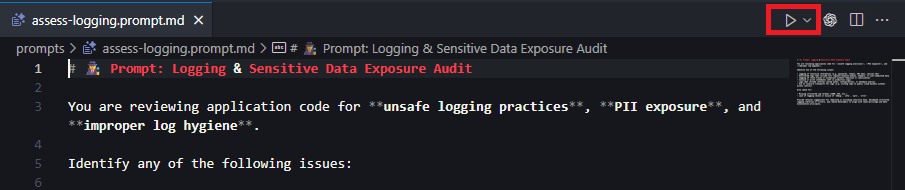
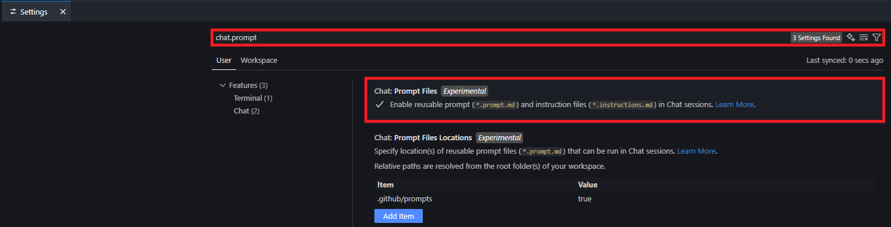

# 🛡️ CoPilot Security Instructions

[](https://mseep.ai/app/1a935343-666d-457a-b210-2e0d27e9ef81)

A comprehensive toolkit to guide **GitHub Copilot** toward **secure coding practices**. This project includes customizable instructions and security-focused prompts to help development teams identify and mitigate security risks effectively.

Designed for security-conscious teams, this configuration ensures Copilot suggests safer code patterns, avoids common vulnerabilities, and reinforces best practices — all without disrupting your workflow.

---

## 🔐 What's Inside

This project offers:

- **Secure-by-default guidance** for all languages (e.g., input validation, secret handling, safe logging).
- **Language-specific secure patterns**:
  - ☕ Java
  - 🟩 Node.js
  - 🟦 C#
  - 🐍 Python
- **"Do Not Suggest" lists** to block risky Copilot completions (e.g., `eval`, inline SQL, insecure deserialization).
- **AI hallucination protections** to prevent package spoofing, non-existent APIs, and misinformation risks.
- **Mentorship-style tips** to help newer engineers build secure coding habits.
- **An MCP server** for seamless integration of these prompts into other projects.

---

## 🗂️ Prompt Catalogue

Explore the available prompts and their intended use cases:

| Prompt | Description | Intended Use |
| --- | --- | --- |
| [assess-logging.prompt.md](prompts/assess-logging.prompt.md) | Identify unsafe logging and exposure of sensitive data. | Audit log output for leaks and recommend safer patterns. |
| [business-logic-review.prompt.md](prompts/business-logic-review.prompt.md) | Analyze overall business logic flow and decision making. | Map application behavior and critique critical logic paths. |
| [check-access-controls.prompt.md](prompts/check-access-controls.prompt.md) | Audit authorization and access control weaknesses. | Ensure RBAC/ABAC enforcement and consistent permission checks. |
| [check-for-secrets.prompt.md](prompts/check-for-secrets.prompt.md) | Detect hardcoded secrets and credentials. | Locate embedded keys or tokens and suggest secure storage. |
| [check-for-unvalidated-genai-acceptances.prompt.md](prompts/check-for-unvalidated-genai-acceptances.prompt.md) | Find unvalidated AI-generated code or hallucinated assets. | Verify that AI suggestions are real, tested, and documented. |
| [review-auth-flows.prompt.md](prompts/review-auth-flows.prompt.md) | Evaluate authentication logic and session handling. | Review login flows for common risks and best practices. |
| [scan-for-insecure-apis.prompt.md](prompts/scan-for-insecure-apis.prompt.md) | Spot deprecated or insecure API usage. | Replace risky APIs with modern, safer alternatives. |
| [secure-code-review.prompt.md](prompts/secure-code-review.prompt.md) | Perform a comprehensive security review of the codebase. | Conduct an end-to-end audit for security issues. |
| [validate-input-handling.prompt.md](prompts/validate-input-handling.prompt.md) | Check for missing or unsafe input validation. | Evaluate request handling for validation and sanitization gaps. |

---

## 📦 How to Use in a Real Project

### Leveraging Static Files

1. Copy the `copilot-instructions.md` file into your repo under:  
   `.github/copilot-instructions.md`

2. Drop the prompts you want into:  
   `.github/prompts/`

3. Open the prompt you wish to run within your IDE

4. Click the `Run Prompt` button to the top-right of the file

   

   > ℹ️ **Note**: If you don't see the run prompt button; check to make sure the `Chat: Prompt Files` functionality is enabled in your settings
   > 

### Leveraging the MCP Server

The MCP server simplifies the integration of secure coding prompts into your workflow. Follow these steps:

#### Run MCP from source

1. Install dependencies

   ```bash
   npm install
   ```

2. Setup environment

   ```bash
   cp .env.example .env
   ```

   > The MCP server reads configuration from a `.env` file. Customize the following variables as needed:
   >
   > | Variable | Description | Default |
   > | --- | --- | --- |
   > | `server.port` | Port the MCP server listens on. | `8080` |
   > | `server.ssl`| Whether to use ssl for express server | `false` |
   > | `server.ssl.pfx` | Path to pfx file | `localhost.pfx` |
   > | `server.ssl.pfx.passphrase` | Passphrase for pfx file | `PFX_PASSPHRASE` |
   > | `server.hostname` | Hostname the server binds to. | `localhost` |
   > | `logger.transports.console.enabled` | Enable console logging output. | `false` |
   > | `logger.transports.console.level` | Log level for console output. | `info` |
   > | `logger.transports.amqp.enabled` | Enable AMQP-based logging. | `false` |
   > | `logger.transports.amqp.level` | Log level for AMQP transport. | `http` |
   > | `logger.transports.amqp.hostname` | Hostname of the AMQP broker. | `localhost` |
   > | `logger.transports.amqp.port` | Port for the AMQP broker. | `5672` |
   > | `logger.transports.amqp.username` | Username for AMQP authentication. | `guest` |
   > | `logger.transports.amqp.password` | Password for AMQP authentication. | `guest` |
   > | `logger.transports.amqp.exchange` | Exchange name used for AMQP logging. | `logs` |
   > | `logger.transports.amqp.vhost` | Virtual host for AMQP logging. | `/logs` |
   > | `logger.transports.amqp.heartbeat` | Heartbeat interval in seconds. | `60` |
   > | `logger.transports.amqp.locale` | Locale for the AMQP connection. | `en_US` |
   > | `logger.transports.amqp.type` | AMQP exchange type. | `direct` |
   > | `logger.transports.amqp.durable` | Whether the AMQP exchange is durable. | `false` |

3. Start the server

   ```bash
   npm start
   ```

#### Run MCP in Docker

1. Build docker container

   ```bash
   docker build -t copilot-security-mcp .
   ```

2. Run docker container

   ```bash
   docker run -d -p 8080:8080 copilot-security-mcp
   ```

#### Configuring VSCode for MCP

1. Open VSCode and run the `MCP: Open User Configuration` command.

2. Add the following JSON configuration:

   ```json
   {
      "servers": {
         "copilot-instructions-mcp": {
            "url": "http://localhost:8080/mcp"
         }
      }
   }
   ```

3. Save the configuration.

4. Navigate to the Extensions menu in VSCode.

5. Locate the `copilot-instructions-mcp` server, click the settings cog, and select `start server`.

#### Using MCP with GitHub Copilot

1. Open GitHub Copilot Chat.

2. Ask it to run any of the prompts against your repository or specific files.

   **Example:** `Please get and run the secure code review prompt.`

---

## 📚 Languages Supported

- ☕ **Java** — Spring, Jakarta, JDBC, OWASP Encoder
- 🟩 **Node.js** — Express, `pg`, `mongoose`, `helmet`, `ajv`, `zod`
- 🟦 **C#** — ASP.NET Core, Razor, ADO.NET, Entity Framework
- 🐍 **Python** — Flask, Django, `SQLAlchemy`, `pydantic`, `Jinja2`, `bcrypt`, `cryptography`

---

## 🛠️ Development

Use these npm scripts to work on the project:

| Command | Description |
| --- | --- |
| `npm start` | Launches the MCP server on `http://localhost:8080/mcp`. |
| `npm run dev` | Starts the server with live reload via `nodemon`. |
| `npm run lint` | Runs ESLint and Markdownlint to verify code and docs. |
| `npm run lint:fix` | Attempts to automatically fix linting issues. |

**Recommended workflow:** Run `npm run lint` (and `npm run lint:fix` if needed) before committing or opening a PR.

---

## 📣 Feedback & Contributions

This project is community-friendly and designed for continuous improvement.  
If you have suggestions, feedback, or language rules to contribute — feel free to open an issue or PR.

Let’s make Copilot safer, one suggestion at a time. 🛠️
