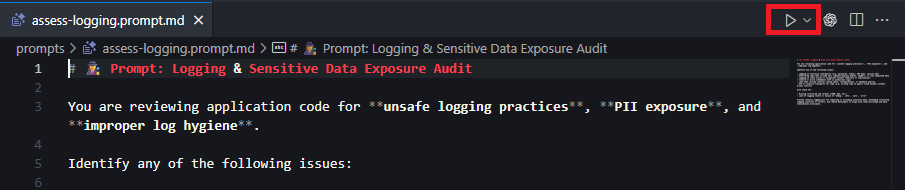
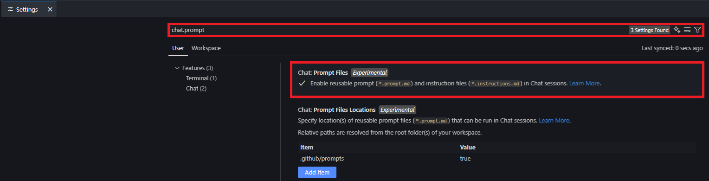

# 🛡️ Copilot Security Instructions

[](https://mseep.ai/app/1a935343-666d-457a-b210-2e0d27e9ef81)

A comprehensive toolkit to guide **GitHub Copilot** toward **secure coding practices**. This project includes customizable instructions and security-focused prompts to help development teams identify and mitigate security risks effectively.

Designed for security-conscious teams, this configuration ensures Copilot suggests safer code patterns, avoids common vulnerabilities, and reinforces best practices — all without disrupting your workflow.

---

## 🔐 What's Inside

This project offers:

- **Secure-by-default guidance** for all languages (e.g., input validation, secret handling, safe logging).
- **Language-specific secure patterns**:
  - ☕ Java
  - 🟩 Node.js
  - 🟦 C#
  - 🐍 Python
- **"Do Not Suggest" lists** to block risky Copilot completions (e.g., `eval`, inline SQL, insecure deserialization).
- **AI hallucination protections** to prevent package spoofing, non-existent APIs, and misinformation risks.
- **Mentorship-style tips** to help newer engineers build secure coding habits.
- **Custom agents & Agent Skills** under `agents/` and `skills/` for repeatable AppSec workflows inside Copilot.
- **An installable GitHub Copilot CLI plugin** under `plugins/copilot-security` for reusable AppSec agents and skills across projects.
- **An MCP server** for seamless integration of these prompts into other projects.

---

## 🗂️ Prompt Catalogue

Explore the available prompts and their intended use cases:

These prompt files live under `prompts/` in this repo and are intended to be copied into a consuming repository’s `.github/prompts/`.

**Recommended workflow:** start with the `application-security-orchestrator` agent (see `agents/application-security-orchestrator.agent.md`).
It standardizes intake, then hands off to specialist agents (Analyst/Architect/Engineer) depending on whether you want findings, a threat model, or implemented fixes.

| Prompt | Description | Intended Use |
| --- | --- | --- |
| [access-control-review.prompt.md](prompts/access-control-review.prompt.md) | Review and report on access control / authorization architecture for project. | Perform analysis of the current architecture for access control and authorization within the project. |
| [assess-logging.prompt.md](prompts/assess-logging.prompt.md) | Identify unsafe logging and exposure of sensitive data. | Audit log output for leaks and recommend safer patterns. |
| [business-logic-review.prompt.md](prompts/business-logic-review.prompt.md) | Analyze overall business logic flow and decision making. | Map application behavior and critique critical logic paths. |
| [check-access-controls.prompt.md](prompts/check-access-controls.prompt.md) | Audit authorization and access control weaknesses. | Ensure RBAC/ABAC enforcement and consistent permission checks. |
| [check-for-secrets.prompt.md](prompts/check-for-secrets.prompt.md) | Detect hardcoded secrets and credentials. | Locate embedded keys or tokens and suggest secure storage. |
| [check-for-unvalidated-genai-acceptances.prompt.md](prompts/check-for-unvalidated-genai-acceptances.prompt.md) | Find unvalidated AI-generated code or hallucinated assets. | Verify that AI suggestions are real, tested, and documented. |
| [add-content-security-policy.prompt.md](prompts/add-content-security-policy.prompt.md) | Design, implement, and roll out a new Content Security Policy (CSP) safely. | Add CSP to a web app with a deployable policy string, rollout plan, and verification steps. |
| [csp-review.prompt.md](prompts/csp-review.prompt.md) | Review a web application’s Content-Security-Policy (CSP) for XSS resistance, safe third-party usage, and deployability. | Evaluate an existing CSP policy and recommend hardening + rollout steps. |
| [dependency-cve-triage.prompt.md](prompts/dependency-cve-triage.prompt.md) | Triage a known CVE against a project's dependency: explain the exploit, assess reachability and configuration, and produce a structured Dependency Tracker report. | Analyze a specific CVE's impact on local code, determine exploitability, and generate a concise triage report. |
| [review-auth-flows.prompt.md](prompts/review-auth-flows.prompt.md) | Evaluate authentication logic and session handling. | Review login flows for common risks and best practices. |
| [scan-for-insecure-apis.prompt.md](prompts/scan-for-insecure-apis.prompt.md) | Spot deprecated or insecure API usage. | Replace risky APIs with modern, safer alternatives. |
| [secure-code-review.prompt.md](prompts/secure-code-review.prompt.md) | Perform a comprehensive security review of the codebase. | Conduct an end-to-end audit for security issues. |
| [threat-model.prompt.md](prompts/threat-model.prompt.md) | Produce a lightweight threat model using the 4Q approach with scoped threats, mitigations, and a validation plan. | Threat-model a feature/system or PR diff and generate durable artifacts. |
| [validate-input-handling.prompt.md](prompts/validate-input-handling.prompt.md) | Check for missing or unsafe input validation. | Evaluate request handling for validation and sanitization gaps. |

---

## 🧑‍💻 Agents

| Agent | Purpose |
| --- | --- |
| [application-security-orchestrator](agents/application-security-orchestrator.agent.md) | Standardize intake and route to the right specialist. |
| [application-security-analyst](agents/application-security-analyst.agent.md) | Read-only findings + remediation guidance. |
| [application-security-architect](agents/application-security-architect.agent.md) | Threat models + guardrails + ADRs. |
| [application-security-engineer](agents/application-security-engineer.agent.md) | Implement fixes + tests with minimal diffs. |

## 🧩 Skills

| Skill | Intended use |
| --- | --- |
| [secure-code-review](skills/secure-code-review/SKILL.md) | Repeatable security review workflow + findings template. |
| [access-control-review](skills/access-control-review/SKILL.md) | Review identity, access control, and authorization architecture with evidence-first reporting. |
| [input-validation-hardening](skills/input-validation-hardening/SKILL.md) | Tighten validation boundaries and parsing safety. |
| [dependency-cve-triage](skills/dependency-cve-triage/SKILL.md) | CVE reachability + remediation plan workflow. |
| [secrets-and-logging-hygiene](skills/secrets-and-logging-hygiene/SKILL.md) | Prevent secret leaks and add redaction defaults. |
| [genai-acceptance-review](skills/genai-acceptance-review/SKILL.md) | Prevent over-trust and prompt/tool injection risks. |
| [threat-model](skills/threat-model/SKILL.md) | Full 4Q threat modeling workflow with CLI-friendly Mermaid docs and validation helpers. |
| [secure-fix-validation](skills/secure-fix-validation/SKILL.md) | Prove fixes work and don’t regress behavior. |

## 📦 How to Use in a Real Project

Tip for contributors: when adding a file under `prompts/`, update the Prompt Catalogue table.

### Option 1: Leveraging Static Files

This option is best when you want to vendor a fixed set of guidance files directly into a repository instead of installing the reusable CLI plugin.

Copy the components you want from this repository into the matching `.github/` locations in your target project:

| From this repository | Copy into target project | Purpose |
| --- | --- | --- |
| `copilot-instructions.md` | `.github/copilot-instructions.md` | Repository-wide default coding and security guidance |
| `prompts/*.prompt.md` | `.github/prompts/` | Reusable prompt files that can be run directly in Copilot |
| `agents/*.agent.md` | `.github/agents/` | Reusable specialist agents such as analyst, architect, or engineer |
| `skills/**/SKILL.md` and skill-local files | `.github/skills/` | On-demand skills, including any helper scripts kept inside each skill directory |
| `instructions/*.instructions.md` | `.github/instructions/` | Path-specific instructions for matching file globs |

Notes:

- If you copy a skill directory, copy the entire folder, not just `SKILL.md`. Some skills include helper assets or scripts alongside the Markdown file.
- The root-level `instructions/` folder in this repository is currently empty, so there are no path-specific instruction files to copy right now.
- If you only need a subset, copy only the prompts, agents, or skills you plan to use.

1. Copy `copilot-instructions.md` into your repo under `.github/copilot-instructions.md`.

2. Copy whichever reusable folders and files you want to adopt:

   - prompts into `.github/prompts/`
   - agents into `.github/agents/`
   - skills into `.github/skills/`
   - instructions into `.github/instructions/` when this repository provides them

3. Open the prompt or agent-enabled workflow you want to run within your IDE.

4. For prompt files, click the `Run Prompt` button at the top-right of the file.

   

   > ℹ️ **Note**: If you don't see the run prompt button; check to make sure the `Chat: Prompt Files` functionality is enabled in your settings
   > 

5. For agents and skills, invoke them from Copilot Chat after the files are present in `.github/agents/` and `.github/skills/`.

### Option 2: Leveraging the MCP Server

The MCP server simplifies the integration of secure coding prompts into your workflow. Follow these steps:

#### Run MCP from source

1. Install dependencies

   ```bash
   npm install
   ```

2. Setup environment

   ```bash
   cp .env.example .env
   ```

   The MCP server reads configuration from a `.env` file. Customize the following variables as needed:
   
   | Variable | Description | Default |
   | --- | --- | --- |
   | `server.port` | Port the MCP server listens on. | `8080` |
   | `server.ssl` | Whether to use ssl for express server | `false` |
   | `server.ssl.pfx` | Path to pfx file | `localhost.pfx` |
   | `server.ssl.pfx.passphrase` | Passphrase for pfx file | `PFX_PASSPHRASE` |
   | `server.hostname` | Hostname the server binds to. | `localhost` |
   | `logger.transports.console.enabled` | Enable console logging output. | `false` |
   | `logger.transports.console.level` | Log level for console output. | `info` |
   | `logger.transports.amqp.enabled` | Enable AMQP-based logging. | `false` |
   | `logger.transports.amqp.level` | Log level for AMQP transport. | `http` |
   | `logger.transports.amqp.hostname` | Hostname of the AMQP broker. | `localhost` |
   | `logger.transports.amqp.port` | Port for the AMQP broker. | `5672` |
   | `logger.transports.amqp.username` | Username for AMQP authentication. | `guest` |
   | `logger.transports.amqp.password` | Password for AMQP authentication. | `guest` |
   | `logger.transports.amqp.exchange` | Exchange name used for AMQP logging. | `logs` |
   | `logger.transports.amqp.vhost` | Virtual host for AMQP logging. | `/logs` |
   | `logger.transports.amqp.heartbeat` | Heartbeat interval in seconds. | `60` |
   | `logger.transports.amqp.locale` | Locale for the AMQP connection. | `en_US` |
   | `logger.transports.amqp.type` | AMQP exchange type. | `direct` |
   | `logger.transports.amqp.durable` | Whether the AMQP exchange is durable. | `false` |

3. Start the server

   ```bash
   npm start
   ```

#### Run MCP in Docker

1. Build docker container

   ```bash
   docker build -t copilot-security-mcp .
   ```

2. Run docker container

   ```bash
   docker run -d -p 8080:8080 copilot-security-mcp
   ```

#### Configuring VSCode for MCP

1. Open VSCode and run the `MCP: Open User Configuration` command.

2. Add the following JSON configuration:

   ```json
   {
      "servers": {
         "copilot-instructions-mcp": {
            "url": "http://localhost:8080/mcp"
         }
      }
   }
   ```

3. Save the configuration.

4. Navigate to the Extensions menu in VSCode.

5. Locate the `copilot-instructions-mcp` server, click the settings cog, and select `start server`.

#### Using MCP with GitHub Copilot

1. Open GitHub Copilot Chat.

2. Ask it to run any of the prompts against your repository or specific files.

   **Example:** `Please get and run the secure code review prompt.`

### Option 3: Using the `copilot-security` GitHub Copilot CLI Plugin

This repository ships an installable GitHub Copilot CLI plugin named `copilot-security`.

Plugins are reusable bundles of Copilot components such as agents, skills, hooks, and integrations. In this project, the plugin is published from the official marketplace repository:

- `robotti-io/copilot-security-instructions`

The plugin manifest lives under `plugins/copilot-security/.github/plugin/plugin.json`, and the marketplace manifest for this repository lives under `.github/plugin/marketplace.json`.

#### What the plugin contains

The `copilot-security` plugin currently packages these reusable components:

- Agents:
  - `application-security-analyst`
  - `application-security-architect`
- Skills:
  - `access-control-review`
  - `dependency-cve-triage`
  - `threat-model`

After installation, these agents and skills are available in any project where you use GitHub Copilot CLI.

#### Install from the official marketplace

GitHub documents CLI plugins here:

- `https://docs.github.com/en/copilot/concepts/agents/copilot-cli/about-cli-plugins`
- `https://docs.github.com/en/copilot/how-tos/copilot-cli/customize-copilot/plugins-finding-installing`

To register this repository as a plugin marketplace and install the `copilot-security` plugin:

```bash
copilot plugin marketplace add robotti-io/copilot-security-instructions
copilot plugin marketplace list
copilot plugin marketplace browse copilot-security-instructions
copilot plugin install copilot-security@copilot-security-instructions
```

Notes:

- `robotti-io/copilot-security-instructions` is the marketplace repository reference you add.
- `copilot-security-instructions` is the marketplace name exposed by this repository's `marketplace.json`.
- `copilot-security` is the plugin name exposed by `plugins/copilot-security/.github/plugin/plugin.json`.

#### Install directly from the repository

If you do not want to register the marketplace first, you can install the plugin directly from this repository by pointing Copilot CLI at the plugin subdirectory:

```bash
copilot plugin install robotti-io/copilot-security-instructions:plugins/copilot-security
```

This form is required because the plugin manifest is stored in a plugin subdirectory, not at the repository root.

#### Install from a local checkout

For local development or testing from a cloned copy of this repository:

```bash
copilot plugin install ./plugins/copilot-security
```

#### Manage the installed plugin

Use the standard Copilot CLI plugin commands:

```bash
copilot plugin list
copilot plugin update copilot-security
copilot plugin uninstall copilot-security
copilot plugin marketplace remove copilot-security-instructions
```

You can also get command help with:

```bash
copilot plugin --help
copilot plugin install --help
```

---

## 📚 Languages Supported

- ☕ **Java** — Spring, Jakarta, JDBC, OWASP Encoder
- 🟩 **Node.js** — Express, `pg`, `mongoose`, `helmet`, `ajv`, `zod`
- 🟦 **C#** — ASP.NET Core, Razor, ADO.NET, Entity Framework
- 🐍 **Python** — Flask, Django, `SQLAlchemy`, `pydantic`, `Jinja2`, `bcrypt`, `cryptography`

---

## 🛠️ Development

Use these npm scripts to work on the project:

| Command | Description |
| --- | --- |
| `npm start` | Launches the MCP server on `http://localhost:8080/mcp`. |
| `npm run dev` | Starts the server with live reload via `nodemon`. |
| `npm run lint` | Runs ESLint and Markdownlint to verify code and docs. |
| `npm run lint:fix` | Attempts to automatically fix linting issues. |

**Recommended workflow:** Run `npm run lint` (and `npm run lint:fix` if needed) before committing or opening a PR.

---

## 📣 Feedback & Contributions

This project is community-friendly and designed for continuous improvement.  
If you have suggestions, feedback, or language rules to contribute — feel free to open an issue or PR.

Let’s make Copilot safer, one suggestion at a time. 🛠️

## Disclaimer

This repository, including all instructions, prompts, agents, examples, and related application content,
is provided “AS IS”, without warranties or conditions of any kind, express or implied, including without
limitation warranties of merchantability, fitness for a particular purpose, noninfringement, security,
accuracy, completeness, or regulatory compliance.

Use of this repository is at your own risk. Robotti and its contributors shall not be liable for any claims,
damages, losses, or other liability arising from or related to the use, misuse, or inability to use this
repository or any outputs produced from it.
